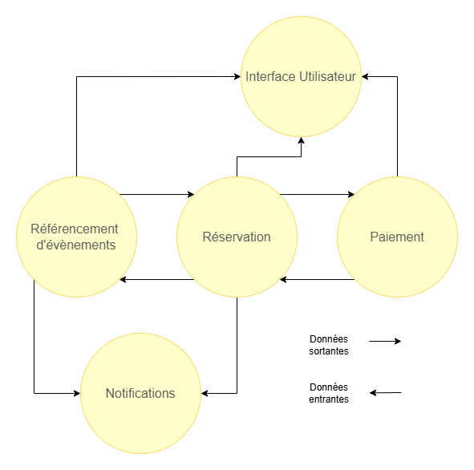

# Context Map

## Schéma général

Diagramme context map des Bounded Contexts et leurs liens.

## Relations et patterns

| Contexte source | Contexte cible  | Pattern de relation | Justification |
|-----------------|-----------------|---------------------|---------------|
| ContexteRéférencement | ContexteInterface | Customer/Supplier | Le but principal du stockage (référencement) des évènements est de pouvoir les afficher via ContexteInterface. La saisie de l'évènement se fait par le programmateur sur l'interface elle-même dictée par le contexte (choix des champs). |
| ContexteRéférencement | ContexteRéservation | Partnership | Les deux contextes collaborent pour tenir leurs informations à jour l'un et l'autre. |
| ContexteRéférencement | ContexteNotification | Customer/Supplier | Le contexte peut fournir des évènements à communiquer aux spectateurs via le canal du ContexteNotification. |
| ContexteRéservation | ContexteRéférencement | Partnership | Les deux contextes collaborent pour tenir leurs informations à jour l'un et l'autre. |
| ContexteRéservation | ContextePaiement | Partnership | Les deux contextes collaborent pour réaliser des actions utilisateur du processus de réservation. |
| ContexteRéservation | ContexteNotification | Customer/Supplier | Le contexte va fournir des informations/fichiers à communiquer aux spectateurs via le canal du ContexteNotification. |
| ContexteRéservation | ContexteInterface | Customer/Supplier | Le ContexteRéservation transmet les données nécessaires à ContexteInterface pour réaliser les actions utilisateur du processus de réservation. |
| ContextePaiement | ContexteRéservation | Partnership | Les deux contextes collaborent pour réaliser des actions utilisateur du processus de réservation. |

## Intégrations techniques envisagées

#### Référencement d'évènements 
Intégré sous forme d'API REST, on peut accéder aux listes d'évènements et autres ressources via des requêtes HTTP.
Contextes cibles : ContexteInterface, ContexteRéservation, ContexteNotification
Exemple : ContexteInterface va utiliser des requêtes HTTP GET pour récupérer des listes d'évènements à afficher sur une page web.

#### Notifications 
Utilisation d'un message broker pour communiquer avec ce contexte.
Contextes sources : ContexteRéservation, ContexteRéférencement
Exemple : ContexteRéservation va envoyer un message pour demander à ContexteNotification l'envoi d'un email contenant le billet acheté à la fin d'une réservation.

#### Paiement
communication par appels API 
