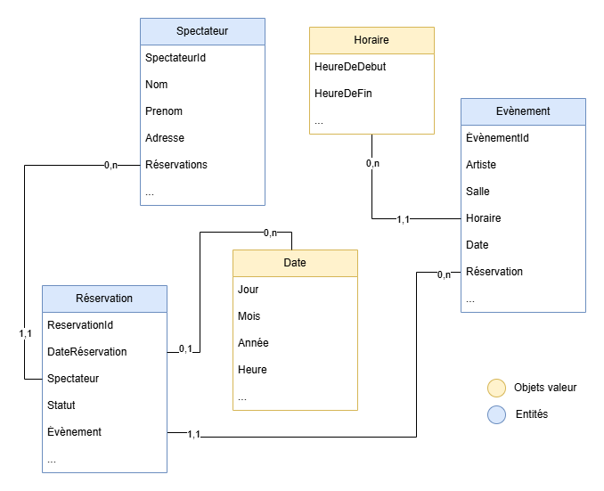

# Entités et Objets Valeur – Vue conceptuelle

## Entités

| Entité | Description métier | Identifiant métier |
|--------|--------------------|--------------------|
| Évènement | Correspond à une prestation d'Artiste donné dans une Salle à une Date donnée. Plusieurs Réservations peuvent être associées à un Évènement, elles permettent à un Spectateur d'y accéder. Un Évènement n'est disponible à la Réservation que lorsque sa date d'OuvertureRéservations est atteinte. En fonction de la salle où il se déroule, il possède un nombre de places limité. | EvenementId |
| Réservation | Une réservation attribue une Place d'un Evènement pour un Spectateur. Le cycle de réservation commence au choix de l'Evènement par le spectateur, continue lorsqu'il sélectionne une Place sur le plan de la Salle. Puis l'ajout dans le panier et le Paiement de la Réservation sont les étapes obligatoires pour valider la Réservation. La Réservation a donc un statut tout au long de ce cycle, on y associe un Évènement et un Spectateur | ReservationId |
| Spectateur | Correspond à un utilisateur de la plateforme ayant la possibilité de consulter des Évènements, réaliser des Réservations pour ceux-ci et demander à être alerté pour des OuvertureRéservations. Il est défini par son identité civile (nom, prénom, ...), ses informations de contact (email, numéro de téléphone, ...), ses informations bancaires si elles sont mémorisées, etc.  | SpectateurId |

## Objets Valeur

| Objet Valeur | Description métier | Propriétés principales |
|--------------|--------------------|------------------------|
| Adresse d'une salle | Emplacement géographique précis correspondant à une salle de spectacle accueillant des Évènements. | Rue, ville, code postal, étage, ... |
| Horaires d'un Évènement | Plage horaire encadrant la durée d'un Évènement. | Heure de début, heure de fin |
| Date d'une Réservation  | Information précisant le moment où une Réservation pour un Évènement a été effectuée sur la plateforme. | jour, mois, année, heure |

## Diagramme UML (conceptuel)

