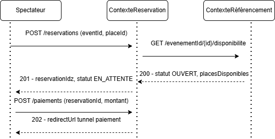
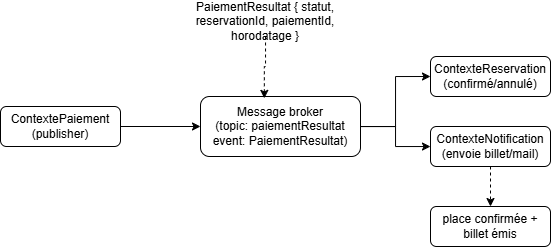

# Design des intégrations inter-contextes

---

## 1. Intégration REST

### Schéma

### Narration

Lorsque le spectateur valide son panier, **contexteRéservation** appelle d'abord **contexteRéférencement** en GET synchrone pour vérifier que l'événement est `OUVERT` et que des places restent disponibles. Si la vérification est positive, il verrouille la place et crée la réservation en statut `EN_ATTENTE`. Il soumet ensuite une demande de paiement à **contextePaiement** via un POST, qui répond avec un `202 Accepted` et une URL de redirection vers le tunnel de paiement (3DS). Chaque contexte reste autonome : contexteRéservation pilote le flux sans connaître les détails métier de ses dépendances. En cas d'erreur (événement complet, paiement rejeté), chaque contexte retourne un code d'erreur explicite qui permet à contexteRéservation de libérer la place verrouillée.

---

## 2. Intégration par événements (Publish / Subscribe)

### Schéma

### Narration

Une fois le paiement traité, **contextePaiement** publie un événement `PaiementResultat` sur un topic dédié du message broker (ex. RabbitMQ/Kafka), sans connaître ses consommateurs. **contexteRéservation** souscrit à ce topic pour passer la réservation en `CONFIRMÉE` ou la libérer en cas d'échec. **contexteNotification** souscrit indépendamment au même topic pour déclencher l'envoi du billet et de la facture par e-mail. Les deux consommateurs opèrent en parallèle, sans couplage entre eux. Ce découplage garantit que l'ajout d'un nouveau consommateur (ex. un service analytique) ne nécessite aucune modification des contextes existants.