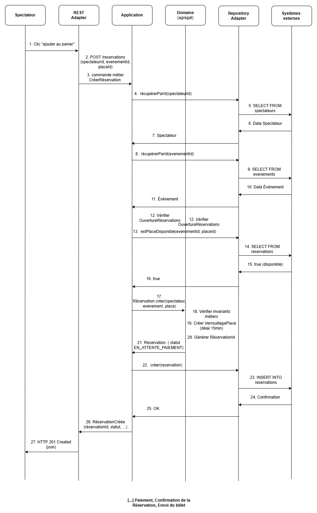

# Scénarios d'intégration

---

## Introduction

Ce document présente un scénario d'intégration end-to-end complet, illustrant comment un cas d'usage métier traverse l'ensemble de l'architecture hexagonale, depuis la réception d'une requête externe jusqu'à la mise à jour du domaine et la persistance. Le scénario choisi est la **création et confirmation d'une Réservation**, qui implique plusieurs Bounded Contexts (ContexteRéservation, ContextePaiement, ContexteNotification) et illustre les interactions entre les couches Domain, Application, et Adapters.

---

## Scénario 1 : Création et confirmation d'une Réservation (end-to-end)

### Contexte métier

Un Spectateur nommé Pierre Martin (SpectateurId : "S-0012") souhaite réserver une place pour le concert "Indochine – Zénith de Paris" prévu le 15 novembre 2026 à 20h00. Les réservations pour cet Évènement sont ouvertes depuis le 27 juin 2026 à 10h00. Pierre consulte l'Évènement sur la plateforme, visualise le plan de la Salle, sélectionne la Place "Tribune B – Rangée 3 – Siège 12" (placeId : "P-1042", tarif : 60 €), l'ajoute à son Panier, puis procède au Paiement. Une fois le Paiement validé, il reçoit son Billet par email.

Ce scénario met en jeu trois phases principales :
1. **Phase 1 — Création de la Réservation** : Sélection de la Place et verrouillage dans le Panier (ContexteRéservation).
2. **Phase 2 — Validation du Paiement** : Saisie des informations bancaires et confirmation de la transaction (ContextePaiement).
3. **Phase 3 — Émission et communication du Billet** : Génération du Billet et envoi par email (ContexteNotification).

---

### Phase 1 : Création de la Réservation et verrouillage de la Place

#### Étape 1.1 : Le Spectateur sélectionne une Place

Pierre consulte l'Évènement "Concert Indochine – Zénith de Paris" (evenementId : "EV-88") via l'interface web de la plateforme. Il visualise le plan interactif de la Salle du Zénith de Paris, qui affiche les Places disponibles par CatégoriePlace (Fosse, Tribune, Balcon). Pierre choisit la Place "Tribune B – Rangée 3 – Siège 12" dans la catégorie Tribune (tarif : 60 €), car elle offre une bonne vue sur la scène. Il clique sur "Ajouter au Panier".

#### Étape 1.2 : L'interface envoie une requête HTTP au REST Adapter

L'interface web (développée en React, par exemple) envoie une requête HTTP POST au backend :

```
POST /reservations
Content-Type: application/json
Authorization: Bearer <JWT token de Pierre>

{
  "spectateurId": "S-0012",
  "evenementId": "EV-88",
  "placeId": "P-1042"
}
```

Le token JWT contient l'identité authentifiée de Pierre. Le REST Adapter extrait le `spectateurId` du token et vérifie qu'il correspond bien à celui fourni dans le corps de la requête (contrôle de cohérence).

#### Étape 1.3 : Le REST Adapter traduit la requête en commande métier

Le REST Adapter (implémenté en FastAPI, NestJS, Spring Boot, ou autre framework) reçoit la requête HTTP, valide la structure du JSON (présence des champs obligatoires, format des identifiants), puis traduit cette requête technique en une **commande métier** : `CréerRéservation(spectateurId: "S-0012", evenementId: "EV-88", placeId: "P-1042")`.

Cette traduction est la responsabilité centrale du REST Adapter : il fait le pont entre le protocole HTTP (technique) et le langage métier (domain). Le REST Adapter invoque ensuite le service applicatif `CréerRéservation`.

#### Étape 1.4 : Le service applicatif orchestre le cas d'usage

Le service applicatif `CréerRéservation` (couche Application) orchestre le cas d'usage. Il effectue les opérations suivantes dans l'ordre :

1. **Récupérer le Spectateur** : Le service invoque le port `RepositorySpectateur.récupérerParId(spectateurId: "S-0012")` pour charger les informations du Spectateur (nom, prénom, email, etc.). Si le Spectateur n'existe pas, une erreur métier est levée.

2. **Récupérer l'Évènement** : Le service invoque le port `RepositoryÉvènement.récupérerParId(evenementId: "EV-88")` pour charger l'agrégat Évènement complet (Artiste, Salle, Date, Horaires, OuvertureRéservations, CatégoriePlaces, Places).

3. **Vérifier l'ouverture des réservations** : Le service vérifie que la date courante du système (27 juin 2026, 10h05) est postérieure ou égale à la date d'OuvertureRéservations (27 juin 2026, 10h00). Cette vérification applique l'invariant "Réservation conditionnée à l'OuvertureRéservations". Si les réservations ne sont pas encore ouvertes, une erreur métier est levée.

4. **Vérifier la disponibilité de la Place** : Le service invoque le port `RepositoryRéservation.estPlaceDisponible(evenementId: "EV-88", placeId: "P-1042")` pour vérifier que la Place n'est pas déjà verrouillée ou réservée par un autre Spectateur. Cette opération applique l'invariant "Unicité de Place par Évènement". Si la Place est indisponible, une erreur métier est levée (HTTP 409 Conflict).

5. **Créer l'agrégat Réservation** : Le service appelle la méthode métier de l'agrégat : `Réservation.créer(spectateur, evenement, place)`. L'agrégat Réservation applique ses invariants métier internes : il vérifie la cohérence des données, crée un objet valeur `VerrouillagePlace` avec un délai d'expiration de 15 minutes (calculé à partir de l'heure courante), initialise le statut de la Réservation à `EN_ATTENTE_PAIEMENT`, et génère un identifiant unique `ReservationId` (ex : "RSV-9041").

6. **Persister la Réservation** : Le service invoque le port `RepositoryRéservation.créer(reservation)` pour persister la nouvelle Réservation. L'adapter de persistence (ex : PostgreSQL) traduit cette opération en requêtes SQL INSERT dans les tables `reservations` et `verrouillages_places`, en respectant l'intégrité transactionnelle.

7. **Mettre à jour le stock de Places** : Le service invoque également le port `RepositoryÉvènement.mettreAJourStock(evenementId: "EV-88", categoriePlace: "Tribune", decrementation: 1)` pour décrémenter le nombre de Places disponibles dans la catégorie Tribune de l'Évènement. Cette opération garantit que les informations de disponibilité affichées aux autres Spectateurs sont à jour en temps réel.

#### Étape 1.5 : Le service applicatif retourne un résultat métier

Le service applicatif retourne un résultat métier au REST Adapter : 

```
RéservationCréée(
  reservationId: "RSV-9041",
  statut: "EN_ATTENTE_PAIEMENT",
  verrouillageExpireA: "2026-06-27T10:20:00Z",
  dateReservation: "2026-06-27T10:05:12Z"
)
```

#### Étape 1.6 : Le REST Adapter retourne une réponse HTTP

Le REST Adapter traduit ce résultat métier en réponse HTTP 201 Created :

```
HTTP/1.1 201 Created
Content-Type: application/json

{
  "reservationId": "RSV-9041",
  "statut": "EN_ATTENTE_PAIEMENT",
  "spectateurId": "S-0012",
  "evenementId": "EV-88",
  "placeId": "P-1042",
  "verrouillageExpireA": "2026-06-27T10:20:00Z",
  "dateReservation": "2026-06-27T10:05:12Z"
}
```

Pierre voit dans son interface web que sa Place est verrouillée pour 15 minutes et qu'il doit procéder au Paiement avant 10h20 pour confirmer définitivement sa Réservation.

---

### Phase 2 : Validation du Paiement

#### Étape 2.1 : Le Spectateur saisit ses informations bancaires

Pierre clique sur "Procéder au Paiement". L'interface affiche un formulaire de paiement intégré (ou redirige vers un tunnel de paiement externe 3D Secure). Pierre saisit ses informations bancaires : numéro de carte, date d'expiration, code CVV. Le montant à payer est de 60 € (tarif de la Place Tribune).

#### Étape 2.2 : L'interface envoie une demande de paiement

L'interface envoie une requête HTTP POST au backend pour initier le Paiement :

```
POST /reservations/RSV-9041/paiements
Content-Type: application/json
Authorization: Bearer <JWT token de Pierre>

{
  "reservationId": "RSV-9041",
  "montant": 60.00,
  "devise": "EUR",
  "methodePaiement": "CARTE_BANCAIRE",
  "informationsBancaires": {
    "numeroCarte": "4111111111111111",
    "dateExpiration": "12/2028",
    "cvv": "123"
  }
}
```

**Note** : Dans une implémentation réelle, les informations bancaires sensibles (numéro de carte, CVV) ne transiteraient jamais directement par le backend de la plateforme, mais seraient envoyées directement au prestataire de paiement (Stripe, PayPal, etc.) via un formulaire sécurisé. Ici, pour simplifier le scénario conceptuel, nous faisons transiter ces informations par le backend.

#### Étape 2.3 : Le REST Adapter invoque le service applicatif de Paiement

Le REST Adapter du ContextePaiement traduit la requête en commande métier : `InitierPaiement(reservationId: "RSV-9041", montant: 60.00, devise: "EUR", methodePaiement: "CARTE_BANCAIRE", informationsBancaires: {...})`.

Le service applicatif `InitierPaiement` orchestre le cas d'usage :

1. **Récupérer la Réservation** : Le service invoque le port `RepositoryRéservation.récupérerParId(reservationId: "RSV-9041")` pour charger l'agrégat Réservation. Il vérifie que la Réservation est dans l'état `EN_ATTENTE_PAIEMENT` et que le VerrouillagePlace n'a pas expiré (il reste encore 10 minutes sur les 15 minutes initiales).

2. **Valider le montant** : Le service vérifie que le montant à payer (60 €) correspond bien au tarif de la Place sélectionnée (catégorie Tribune à 60 €). Cette vérification garantit la cohérence métier.

3. **Invoquer l'adapter de Paiement externe** : Le service invoque le port `ServicePaiement.demanderAutorisation(montant: 60.00, devise: "EUR", informationsBancaires: {...})`. L'adapter de Paiement (ex : StripeAdapter, PayPalAdapter) communique avec l'API bancaire externe via le protocole 3D Secure. La banque vérifie les informations du titulaire de la carte, effectue les contrôles de sécurité (disponibilité des fonds, authentification forte), puis retourne une réponse : `autorisationAccordée: true, transactionId: "TXN-78231"`.

4. **Mettre à jour l'agrégat Réservation** : Le service invoque la méthode métier de l'agrégat : `Réservation.confirmerPaiement(paiement: Paiement(montant: 60.00, devise: "EUR", transactionId: "TXN-78231", dateValidation: "2026-06-27T10:12:34Z"))`. L'agrégat Réservation applique ses invariants : il vérifie que le Paiement est obligatoire pour valider la Réservation, change son statut de `EN_ATTENTE_PAIEMENT` à `CONFIRMÉE`, supprime le VerrouillagePlace temporaire (la Place est désormais définitivement attribuée), et génère un objet valeur `Billet` contenant toutes les informations de la Réservation (Spectateur, Évènement, Place, montant payé, QR code unique pour contrôle d'entrée).

5. **Persister la Réservation confirmée** : Le service invoque le port `RepositoryRéservation.mettreAJourStatut(reservationId: "RSV-9041", nouveauStatut: "CONFIRMÉE", paiement: {...}, billet: {...})` pour persister l'état mis à jour de la Réservation. L'adapter PostgreSQL exécute une requête SQL UPDATE pour mettre à jour le statut, enregistrer les informations de Paiement, et stocker le Billet généré.

#### Étape 2.4 : Publier un événement métier

Le service applicatif publie un **événement métier** (Domain Event) : `RéservationConfirmée(reservationId: "RSV-9041", spectateurId: "S-0012", evenementId: "EV-88", billet: {...})`. Cet événement est publié sur un message broker (RabbitMQ, Kafka, etc.) pour notifier les autres Bounded Contexts intéressés.

---

### Phase 3 : Émission et communication du Billet

#### Étape 3.1 : Le ContexteNotification reçoit l'événement métier

Le ContexteNotification écoute les événements métier publiés sur le message broker. Il reçoit l'événement `RéservationConfirmée` et déclenche le cas d'usage `CommuniquerBillet`.

#### Étape 3.2 : Le service applicatif de Notification orchestre l'envoi

Le service applicatif `CommuniquerBillet` du ContexteNotification orchestre le cas d'usage :

1. **Récupérer les informations du Spectateur** : Le service récupère l'email de Pierre Martin via le port `RepositorySpectateur.récupérerParId(spectateurId: "S-0012")` (ou directement depuis l'événement métier si les informations nécessaires y sont incluses).

2. **Générer le contenu de l'email** : Le service génère le contenu de l'email de confirmation en utilisant un template préparé. L'email contient les informations suivantes :
   - Nom du Spectateur : "Pierre Martin"
   - Évènement : "Concert Indochine – Zénith de Paris"
   - Date : "15 novembre 2026 à 20h00"
   - Place : "Tribune B – Rangée 3 – Siège 12"
   - Montant payé : "60 €"
   - Billet en pièce jointe (fichier PDF) avec un QR code unique pour le contrôle d'entrée

3. **Invoquer l'adapter d'envoi d'email** : Le service invoque le port `ServiceNotification.envoyerEmail(destinataire: "pierre.martin@example.com", sujet: "Votre billet pour le concert Indochine", corps: {...}, pieceJointe: billet.pdf)`. L'adapter d'envoi d'email (ex : SendGridAdapter, MailgunAdapter) communique avec le service externe d'emailing pour envoyer le message.

4. **Confirmer l'envoi** : Le service d'emailing retourne une confirmation d'envoi. Le service applicatif enregistre cette confirmation dans un log de traçabilité (optionnel).

#### Étape 3.3 : Pierre reçoit son Billet par email

Pierre reçoit un email de confirmation dans sa boîte mail quelques secondes après la validation du Paiement. Il télécharge le PDF contenant son Billet avec le QR code. Le jour du concert, il présentera ce QR code à l'entrée du Zénith de Paris pour accéder à l'Évènement.

---

## Responsabilité de chaque couche dans le scénario

### Couche Domaine (Domain)

**Responsabilités** :
- Définir les règles métier et les invariants.
- Garantir que les invariants sont toujours respectés à chaque modification de l'état d'un agrégat.

**Exemples dans le scénario** :
- L'agrégat `Réservation` vérifie l'invariant "Unicité de Place par Évènement" lors de la création.
- L'agrégat `Réservation` vérifie l'invariant "Paiement obligatoire pour valider la Réservation" lors de la confirmation.
- L'agrégat `Évènement` garantit que le nombre de Places ne dépasse jamais la capacité de la Salle.

La couche Domaine ne sait rien de HTTP, de SQL, ou de RabbitMQ. Elle manipule uniquement des concepts métier (Réservation, Évènement, Spectateur, Place, Paiement, Billet).

### Couche Application

**Responsabilités** :
- Orchestrer les cas d'usage en coordonnant les appels aux agrégats du domaine.
- Définir les ports (contrats abstraits) pour interagir avec l'extérieur (repositories, services externes).
- Gérer les transactions et la cohérence transversale.
- Publier des événements métier pour notifier les autres Bounded Contexts.

**Exemples dans le scénario** :
- Le service `CréerRéservation` récupère les données (Spectateur, Évènement), vérifie les conditions préalables (ouverture des réservations, disponibilité de la Place), crée l'agrégat Réservation, puis persiste le résultat.
- Le service `InitierPaiement` récupère la Réservation, invoque le service de paiement externe, confirme le Paiement dans l'agrégat, puis persiste l'état mis à jour.
- Le service `CommuniquerBillet` écoute l'événement `RéservationConfirmée` et orchestre l'envoi du Billet par email.

La couche Application connaît les ports (intentions métier), mais ne connaît pas les détails techniques de leur implémentation.

### Couche Adapters (Infrastructure)

**Responsabilités** :
- Fournir les implémentations concrètes des ports définis par l'Application.
- Traduire les requêtes externes (HTTP, messages) en commandes/queries métier.
- Traduire les résultats métier en réponses techniques (JSON, messages).
- Interagir avec les systèmes externes (base de données, APIs bancaires, services d'emailing).

**Exemples dans le scénario** :
- Le **REST Adapter** reçoit les requêtes HTTP (`POST /reservations`, `POST /reservations/{id}/paiements`), les traduit en commandes métier, invoque les services applicatifs, puis retourne les réponses JSON.
- Le **Adapter PostgreSQL** implémente les ports `RepositoryRéservation` et `RepositoryÉvènement`. Il traduit les opérations métier (créer une Réservation, mettre à jour le statut) en requêtes SQL.
- Le **Adapter Stripe** implémente le port `ServicePaiement`. Il communique avec l'API Stripe pour demander l'autorisation d'une transaction bancaire.
- Le **Adapter SendGrid** implémente le port `ServiceNotification`. Il communique avec l'API SendGrid pour envoyer des emails.
- Le **Messaging Adapter (RabbitMQ)** publie les événements métier (`RéservationConfirmée`) sur un message broker et permet aux autres Bounded Contexts de les consommer.

La couche Adapters contient tous les détails techniques. Elle peut être modifiée (changer de base de données, de prestataire de paiement, de service d'emailing) sans impacter le domaine ou l'application, grâce à l'inversion de dépendance.

---

## Diagramme de séquence UML (conceptuel)



---

## Explication du diagramme de séquence

Le diagramme ci-dessus représente les interactions entre les différents acteurs et composants de l'architecture hexagonale lors du scénario end-to-end de création et confirmation d'une Réservation. Voici les points clés :

1. **Acteurs et composants** : Le diagramme distingue le Spectateur (acteur externe), le REST Adapter (couche Adapters), le service applicatif (couche Application), l'agrégat du domaine (couche Domain), l'adapter de repository (couche Adapters), et les systèmes externes (base de données, API bancaire, message broker, service d'emailing).

2. **Flux vertical** : Le temps s'écoule de haut en bas. Chaque flèche représente une interaction (appel de méthode, requête HTTP, requête SQL, message).

3. **Séparation des responsabilités** : Le diagramme illustre clairement que chaque couche a une responsabilité distincte :
   - Le REST Adapter traduit les requêtes HTTP en commandes métier.
   - Le service applicatif orchestre les cas d'usage en appelant les agrégats et les repositories.
   - L'agrégat du domaine applique les invariants métier.
   - Les adapters de persistence et de services externes gèrent les détails techniques.
  
4. **Transactions et cohérence** : Chaque opération de persistence (INSERT, UPDATE) est exécutée dans une transaction pour garantir la cohérence des données. Les adapters PostgreSQL gèrent ces transactions de manière transparente pour le domaine.

Ce diagramme conceptuel ne montre pas tous les détails techniques (gestion des exceptions, retry logic, timeout, etc.), mais illustre le flux principal et la séparation des préoccupations propre à l'architecture hexagonale.