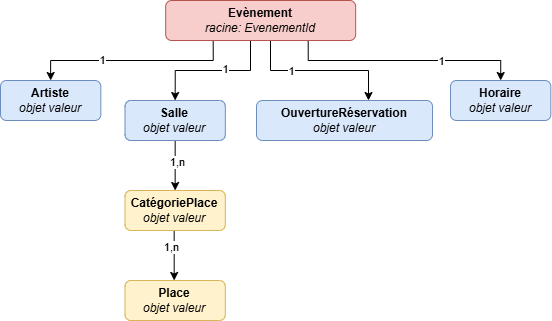
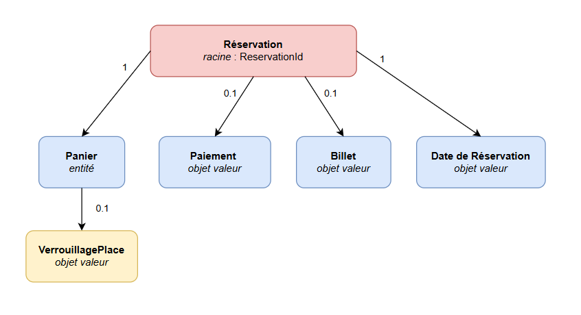

# Agrégats et invariants

---

## Agrégat 1 : Évènement

### Racine de l'agrégat
**Entité racine** : `Évènement` (identifiant : `EvenementId`)

### Entités et Objets Valeur internes

| Élément | Type | Description |
|---------|------|-------------|
| `Évènement` | Entité racine | Prestation d'un Artiste dans une Salle à une Date donnée |
| `Artiste` | Entité interne | Entité se produisant lors de l'Évènement (solo, groupe, compagnie) |
| `Salle` | Entité interne | Lieu géographique avec ses CatégoriePlaces et Places |
| `Horaires d'un Évènement` | Objet Valeur | Heure de début et heure de fin |
| `OuvertureRéservations` | Objet Valeur | Date à partir de laquelle la réservation est possible |

### Invariants métier

| Invariant | Description métier | Conséquence si non respecté |
|-----------|--------------------|----------------------------|
| **Unicité de l'Évènement** | Un Évènement est unique pour une combinaison (Artiste, Salle, Date). Il est impossible de référencer deux Évènements identiques sur la plateforme. Cette contrainte garantit la fiabilité du référencement et évite la confusion pour le Spectateur. | Double référencement d'un même concert, ventes de billets dupliquées, perte de confiance des Spectateurs et des Programmateurs. |
| **Places limitées par la Salle** | Le nombre total de Places disponibles pour un Évènement ne peut pas dépasser la capacité maximale de la Salle. Chaque CatégoriePlace possède un nombre de Places défini lors du référencement. Ce nombre ne peut pas être augmenté après la création de l'Évènement. | Survente (overbooking), impossibilité d'accueillir tous les Spectateurs le jour de l'Évènement, réclamations et remboursements. |
| **Réservation conditionnée à l'OuvertureRéservations** | Un Spectateur ne peut pas réserver de Place pour un Évènement avant la date d'OuvertureRéservations définie par le Programmateur. L'Évènement est consultable dès son référencement mais pas réservable. Cette règle assure un accès équitable pour tous les Spectateurs. | Accès anticipé non désiré à la réservation, rupture d'équité entre Spectateurs, mauvaise expérience utilisateur. |
| **Cohérence des informations de l'Évènement** | Les informations obligatoires d'un Évènement (Date, Salle, Artiste, OuvertureRéservations, au moins une CatégoriePlace avec un tarif) doivent toutes être renseignées avant que l'Évènement soit publié dans l'AffichageRéférentiel. Un Évènement incomplet ne peut pas être visible des Spectateurs. | Affichage d'Évènements sans informations suffisantes, impossibilité pour le Spectateur de prendre une décision éclairée de réservation. |

---

## Agrégat 2 : Réservation

### Racine de l'agrégat
**Entité racine** : `Réservation` (identifiant : `ReservationId`)

### Entités et Objets Valeur internes

| Élément | Type | Description |
|---------|------|-------------|
| `Réservation` | Entité racine | Attribue une Place d'un Évènement à un Spectateur |
| `Panier` | Entité interne | Ensemble de Places sélectionnées, en attente de paiement |
| `VerrouillagePlace` | Objet Valeur | Statut temporaire d'une Place ajoutée au Panier |
| `Paiement` | Entité interne | Autorisation de prélèvement bancaire finalisant la Réservation |
| `Billet` | Entité interne | Document attestant de la Réservation, émis après Paiement |
| `Date d'une Réservation` | Objet Valeur | Moment où la Réservation a été effectuée sur la plateforme |

### Invariants métier

| Invariant | Description métier | Conséquence si non respecté |
|-----------|--------------------|----------------------------|
| **Unicité de Place par Évènement** | Une Place ne peut être attribuée qu'à un seul Spectateur pour un Évènement donné. Dès qu'une Place est ajoutée à un Panier (VerrouillagePlace), elle devient indisponible pour tout autre Spectateur pendant une période donnée. Cette règle est fondamentale pour garantir l'intégrité des stocks. | Survente d'une même Place, deux Spectateurs se retrouvant avec le même siège, réclamations et perte de crédibilité de la plateforme. |
| **Délai de verouillage du Panier** | Un VerrouillagePlace a une durée de vie limitée. Si le Spectateur ne valide pas son Paiement dans le délai imparti, les Places sont libérées et redeviennent disponibles à la Réservation. Ce délai évite la rétention abusive de Places. | Blocage de Places indéfiniment sans intention d'achat, pénurie artificielle, frustration des Spectateurs souhaitant réserver. |
| **Paiement obligatoire pour valider la Réservation** | Une Réservation n'est considérée comme confirmée et un Billet ne peut être émis que si le Paiement a été autorisé avec succès. Un Paiement échoué ou absent maintient la Réservation à l'état en attente. Les Places retournent dans le stock disponible en cas d'échec définitif. | Émission de Billets sans encaissement, perte de revenus, Places considérées comme vendues sans contrepartie financière. |
| **Conformité du Billet avec la Réservation** | Le Billet émis doit correspondre exactement à la Réservation validée : même Spectateur, même Place, même Évènement, même CatégoriePlace et même tarif payé. Aucune modification de ces informations n'est possible après l'émission du Billet. | Billets frauduleux ou incohérents, accès de Spectateurs à des places non réservées, réclamations et litiges. |

---

## Schéma UML des agrégats

---

## Service de Domaine : PromouvoirÉvènement

### Rôle
Encapsuler la logique de décision et de mise à jour de l'AffichagePromotionnel pour un Évènement référencé. Cette opération est transversale : elle mobilise des données du ContexteRéférencement (l'Évènement et ses informations), du ContexteRéservation (le stock de Places restantes, le rythme des ventes) et du rôle du DirecteurCommercial. Elle ne trouve pas naturellement sa place dans l'agrégat Évènement (qui ne connaît pas les règles commerciales) ni dans l'agrégat Réservation (qui ne pilote pas la visibilité).

### Opérations encapsulées
1. **Vérifier l'éligibilité à la promotion** : l'Évènement doit être référencé, publié dans l'AffichageRéférentiel, et posséder encore des Places disponibles. Un Évènement complet ou annulé ne peut pas être promu.
2. **Évaluer l'opportunité commerciale** : consulter le taux de remplissage (Places vendues / Places totales) et la proximité de la Date de l'Évènement pour qualifier le besoin de promotion.
3. **Modifier l'AffichagePromotionnel** : inscrire ou retirer l'Évènement de la liste des Évènements mis en avant, selon la décision du DirecteurCommercial.
4. **Émettre un événement métier** : signaler au ContexteRéférencement que le statut promotionnel de l'Évènement a changé, afin que l'AffichageRéférentiel reflète la mise en avant.

### Invariants propres au service
| Invariant | Description |
|-----------|-------------|
| Promotion réservée aux Évènements éligibles | Seul un Évènement publié avec des Places encore disponibles peut figurer dans l'AffichagePromotionnel. |
| Décision portée par le DirecteurCommercial | La modification de l'AffichagePromotionnel ne peut être déclenchée que par un utilisateur ayant le rôle DirecteurCommercial. |
| Cohérence entre AffichagePromotionnel et stock | Si toutes les Places d'un Évènement promu sont vendues ou verrouillées, le service retire automatiquement l'Évènement de l'AffichagePromotionnel. |